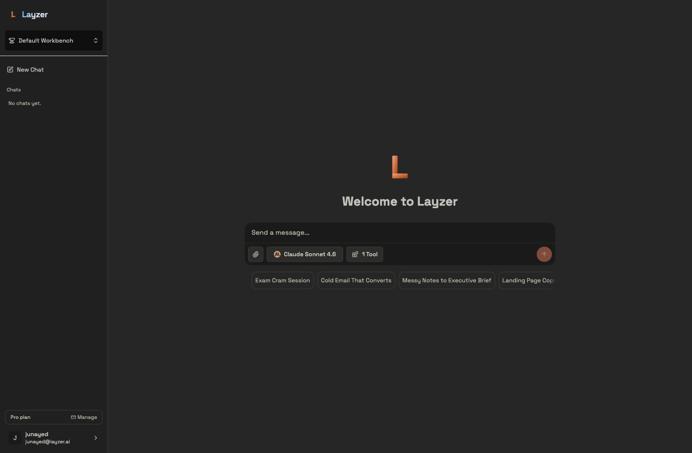

Layzer is an AI chat platform in the spirit of [Poe](https://poe.com), [LibreChat](https://librechat.ai), and [Open WebUI](https://openwebui.com) — pick any AI model and give it superpowers.

Out of the box you can chat with frontier models from Anthropic, OpenAI, Google, and others; build custom assistants with tools, memory, and persona; and connect [MCP](https://modelcontextprotocol.io) servers to extend what each model can do.

Free to try at [layzer.ai](https://layzer.ai).
